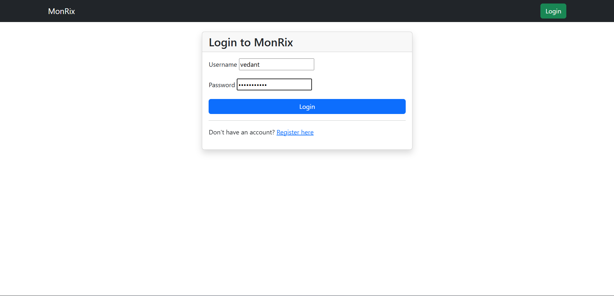
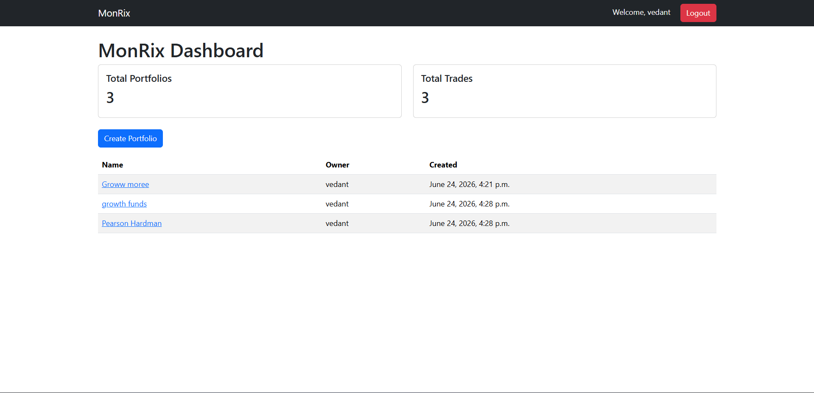
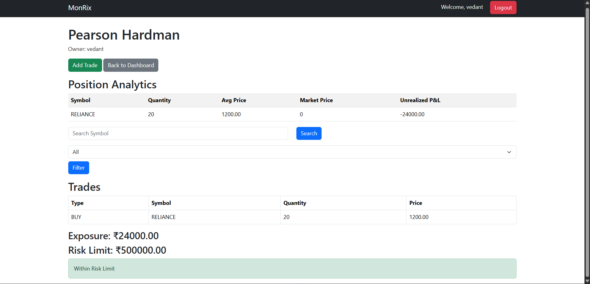
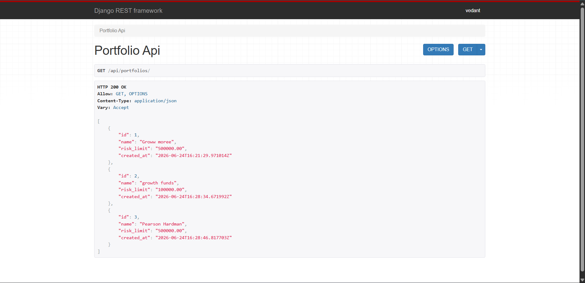

# MonRix – Trade Risk Monitoring Platform

A Django-based financial risk monitoring platform for managing portfolios, tracking trades, calculating exposure, monitoring risk limits, and analyzing portfolio performance.

---

## Features

### Authentication

* User Registration
* Login & Logout
* Portfolio ownership
* Protected routes

### Portfolio Management

* Create portfolios
* Portfolio detail pages
* User-specific portfolio access

### Trade Management

* Buy/Sell trade recording
* Trade history
* Trade search & filtering

### Portfolio Analytics

* Position Tracking
* Exposure Calculation
* Average Cost Basis
* Unrealized P&L

### Risk Monitoring

* Portfolio Risk Limits
* Risk Breach Alerts

### REST APIs

* Portfolio API
* Trade API
* JSON responses via Django REST Framework

---

## Tech Stack

* Python
* Django
* Django ORM
* Django REST Framework
* PostgreSQL / SQLite
* Bootstrap 5

---

## Project Screenshots

### Login Page



---

### Dashboard



---

### Portfolio Metrics



---

### API Endpoint



---

## Installation

Clone the repository:

```bash
git clone <repository-url>
cd MonRix
```

Create virtual environment:

```bash
python -m venv venv
```

Activate virtual environment:

Windows:

```bash
venv\Scripts\activate
```

Install dependencies:

```bash
pip install -r requirements.txt
```

Run migrations:

```bash
python manage.py migrate
```

Create admin user:

```bash
python manage.py createsuperuser
```

Run server:

```bash
python manage.py runserver
```

Visit:

```text
http://127.0.0.1:8000
```

---

## API Endpoints

### Portfolios

```text
/api/portfolios/
```

### Trades

```text
/ api/trades/
```

---

## Learning Outcomes

This project demonstrates:

* Django Models
* ORM Relationships
* Authentication & Authorization
* Form Handling
* Template Inheritance
* Business Logic Design
* REST API Development
* Database Design
* Financial Data Processing
* Risk Monitoring Concepts

---

## Future Improvements

* Market data integration
* Advanced risk analytics
* Portfolio performance charts
* CSV trade imports

---

## Author

Vedant Kadlak

Built as a Django portfolio project to demonstrate backend development, database design, and financial application development.
